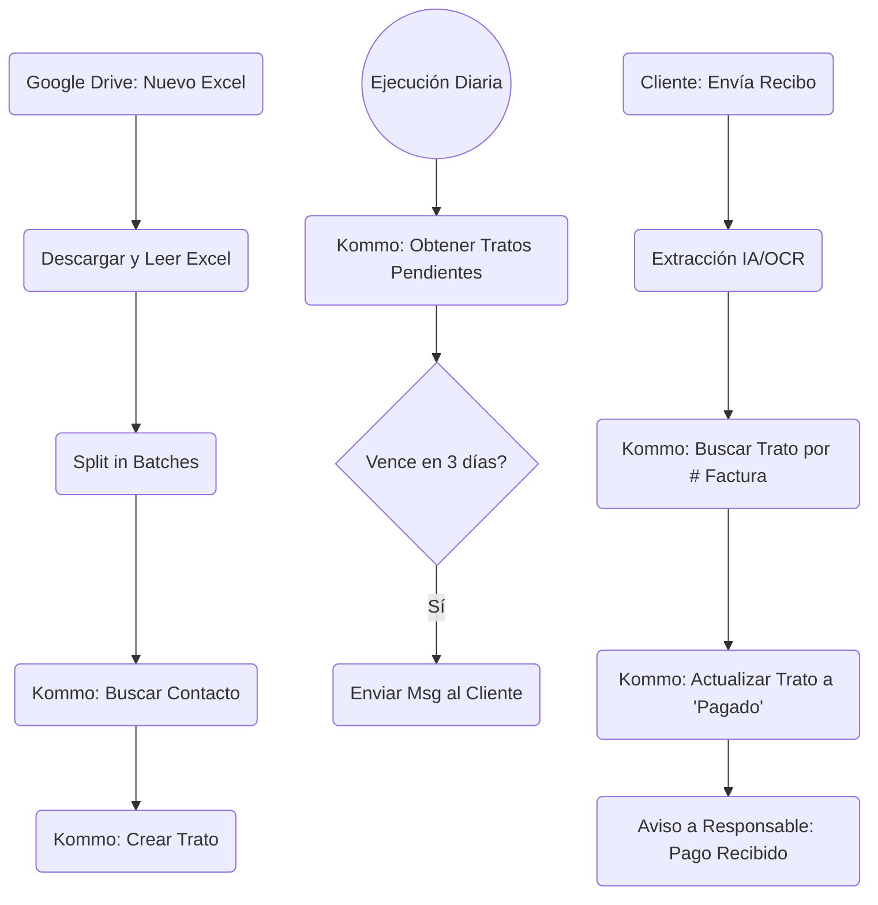

# Documento de Diseño: Automatización n8n - Kommo CRM (Cuentas por Cobrar)

## 1. Visión General
Este documento describe el diseño y flujo de datos de la automatización construida en n8n para la ingesta de cuentas por cobrar desde Google Drive hacia Kommo CRM. Además, se detallan los requisitos y el diseño propuesto para las nuevas funcionalidades pendientes de implementación.

El objetivo principal es automatizar la creación de Tratos (Leads) en Kommo a partir de archivos Excel generados y subidos a Google Drive, así como gestionar eventos posteriores como recordatorios de vencimiento y procesamiento de comprobantes de pago.

---

## 2. Flujo Actual Implementado
El flujo actual de n8n (`workflow_n8n_kommo.json`) consta de los siguientes nodos:

1. **Google Drive Trigger**
   - **Tipo:** `n8n-nodes-base.googleDriveTrigger`
   - **Función:** Monitorea una carpeta específica en Google Drive y se activa automáticamente cuando se detecta la creación de un nuevo archivo (`fileCreated`). Ejecuta una revisión cada minuto.
2. **Descargar Excel**
   - **Tipo:** `n8n-nodes-base.googleDrive`
   - **Función:** Utiliza el ID del archivo detectado en el paso anterior para descargar su contenido.
3. **Leer Excel (Spreadsheet File)**
   - **Tipo:** `n8n-nodes-base.spreadsheetFile`
   - **Función:** Convierte el archivo binario descargado a formato JSON, extrayendo las filas del documento para su procesamiento en n8n.
4. **Split In Batches**
   - **Tipo:** `n8n-nodes-base.splitInBatches`
   - **Función:** Toma el arreglo de datos extraídos y los procesa uno por uno (tamaño de lote = 1).
5. **Buscar Contacto (Kommo)**
   - **Tipo:** `n8n-nodes-base.amocrm`
   - **Función:** Al leer cada fila del lote, realiza una búsqueda del contacto en Kommo usando el campo `TELEFONO1` para asociarlo posteriormente (o verificar su existencia).
6. **Crear Trato (Kommo)**
   - **Tipo:** `n8n-nodes-base.amocrm`
   - **Función:** Crea un nuevo trato (Lead) en el CRM utilizando los datos del Excel:
     - **Nombre del Trato:** `Factura [DOCUMENTO] - [RAZON SOCIAL]`
     - **Valor (Price):** `[SALDO DOC]`
     - **Fecha de Vencimiento:** Se guarda como un campo personalizado (`customFieldValues`) con el valor de `[FECHA VENC]`.

---

## 3. Funcionalidades Pendientes a Implementar

Se han identificado tres requerimientos adicionales de negocio que deben integrarse en el sistema:

1. **Recordatorio de Vencimiento:** Enviar un mensaje cuando la fecha de vencimiento (`FECHA VENC`) esté a 3 días de la fecha de hoy.
2. **Procesamiento de Comprobantes:** Leer imágenes de recibos de pago y actualizar la información del lead (Trato) correspondiente.
3. **Notificación de Pago:** Avisar al responsable (propietario del trato o gerente de cuentas) cuando se realiza un pago.

---

## 4. Diseño Propuesto para las Nuevas Funcionalidades

### 4.1. Recordatorio de Vencimiento (3 Días)
**Flujo Propuesto (Nuevo Workflow de n8n o adición al existente vía Cron):**
1. **Cron Trigger:** Un nodo de `Schedule Trigger` en n8n que se ejecute diariamente (por ejemplo, a las 08:00 AM).
2. **Obtener Leads (Kommo CRM):** Hacer una consulta (`getAll` con filtros) a Kommo CRM para obtener los tratos en la etapa de "Por Cobrar".
3. **Nodo de Fecha (Date & Time o Code):** Calcular la fecha de hoy más 3 días (`Hoy + 3 días`).
4. **Filtro (If Node):** Validar si el campo personalizado `FECHA VENC` del trato coincide con la fecha calculada (`Hoy + 3 días`).
5. **Enviar Mensaje:** Si la condición se cumple, usar la integración de WhatsApp, Correo, o Kommo (vía Chat / Salesbot) para enviar un recordatorio al contacto asociado sobre la proximidad del vencimiento de su factura.

### 4.2. Lectura de Recibos de Pago (OCR) y Actualización de Lead
**Flujo Propuesto (Sub-workflow webhooks):**
Dado que esto involucra extracción de datos de imágenes, se requiere un componente de procesamiento.
1. **Trigger de Recepción de Imagen:** 
   - Si el recibo lo envía el cliente vía WhatsApp/Telegram, el *trigger* es la recepción del webhook/mensaje con el adjunto.
2. **Procesamiento OCR:** Enviar la imagen descargada a una API de Inteligencia Artificial / OCR (por ejemplo, Google Cloud Vision, OpenAI Vision, Document AI u OCR.space).
3. **Extracción de Datos:** Extraer del comprobante mediante el prompt a la IA:
   - Número de Factura (`DOCUMENTO`)
   - Monto Pagado
4. **Buscar Trato en Kommo:** Hacer un nodo `amocrm (Search)` filtrando por el "Número de Factura" encontrado mediante el OCR (este número de factura idealmente debe de guardarse en un campo personalizado o estar en el nombre del trato).
5. **Actualizar Trato:** Una vez encontrado el trato, usar el nodo `amocrm (Update)` para:
   - Cambiar la etapa del pipeline a "Pagado" o "Pago Parcial".
   - Actualizar campos personalizados (Monto pagado, fecha de abono).

### 4.3. Notificación al Responsable del Pago
Este componente es el final lógico del flujo de la sección 4.2.
1. **Detonador:** Después del éxito del nodo de **Actualización del Trato** o mediante un *Webhook* enviado por Kommo CRM al cambiar la etapa de un trato a "Pagado".
2. **Obtener Responsable:** Identificar al usuario/responsable (`Responsible User ID`) del trato en Kommo.
3. **Notificar (Slack / Email / Kommo Notification):**
   - **Vía Kommo:** Crear una tarea interna para el responsable indicando "Pago recibido y validado por la Factura XYZ".
   - **Vía Mensajería Externa:** Si el equipo usa Telegram o Slack enviar un mensaje con los detalles:
     > *"¡Hola! Se ha detectado y registrado un pago para el Lead de la empresa [RAZON SOCIAL], Factura #[DOCUMENTO]. Favor de validar."*

---

## 5. Arquitectura del Sistema Extendido (Diagrama Conceptual)

